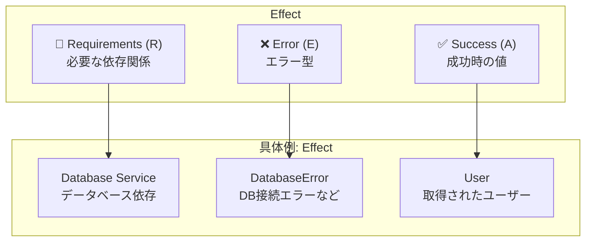
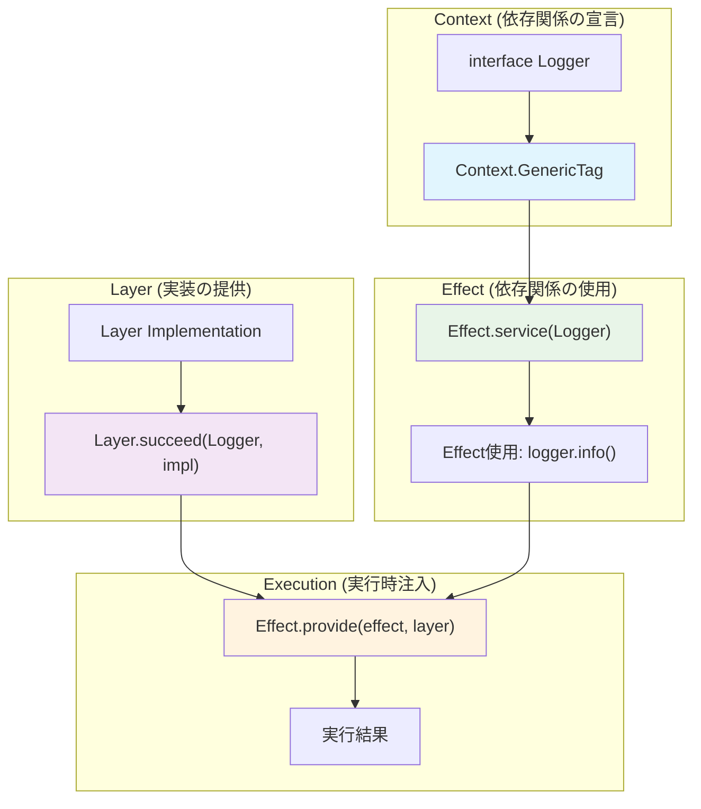
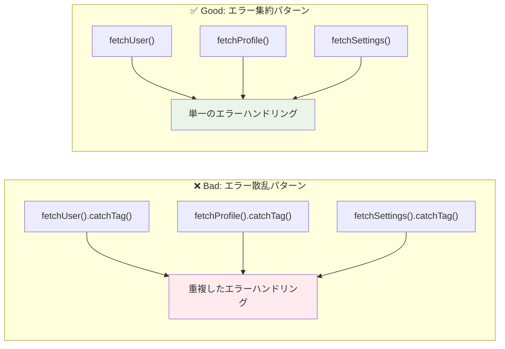
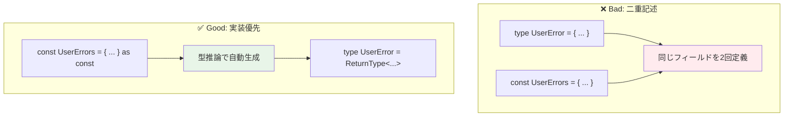

# Effect-ts Complete Reference Guide
*最新版 - 後続LLM向けの完全ドキュメント*

## 🎯 設計哲学とコア概念

### **Effect-ts = ZIOのTypeScript移植 + JavaScript生態系最適化**

Effect-tsは**Scala ZIOの設計哲学**を基盤とし、TypeScriptの型システムとJavaScript生態系に最適化した関数型エフェクトライブラリです。

#### **核心価値**
- **型安全性**: ランタイムエラーの静的排除
- **合成可能性**: 小さなエフェクトから大きなアプリケーション構築
- **テスタビリティ**: 依存注入による完全な分離
- **パフォーマンス**: ファイバーベースの軽量並行性

## 📚 基本型システム

### **Effect<R, E, A> - コア型**

```typescript
Effect<R, E, A>
//     │  │  └─ Success Value Type (成功時の値の型)
//     │  └──── Error Type (エラーの型)
//     └─────── Requirements Type (必要な依存関係の型)

// 例
Effect<Database, DatabaseError, User>
//     │         │               └─ 成功時: User
//     │         └─────────────── 失敗時: DatabaseError
//     └───────────────────────── 必要: Database service
```



### **主要な型バリエーション**

```typescript
// 依存なし、エラーなし
Effect<never, never, string>  // = Effect.succeed("hello")

// 依存あり、エラーなし
Effect<Config, never, string>  // = Effect.service(Config)

// 依存なし、エラーあり
Effect<never, ParseError, User>  // = Effect.fail(new ParseError())

// フル指定
Effect<Database & Logger, DatabaseError | ValidationError, User>
```

## 🔧 Effect 作成パターン

### **基本的なEffect作成**

```typescript
// 成功値
Effect.succeed(42)  // Effect<never, never, number>
Effect.succeed("hello")  // Effect<never, never, string>

// 失敗
Effect.fail(new Error("boom"))  // Effect<never, Error, never>

// 同期的計算
Effect.sync(() => Math.random())  // Effect<never, never, number>

// 非同期Promise変換
Effect.promise(() => fetch("/api/data"))  // Effect<never, never, Response>

// エラーハンドリング付きPromise
Effect.tryPromise({
  try: () => fetch("/api/data"),
  catch: (error) => new NetworkError(error.message)
})  // Effect<never, NetworkError, Response>
```

### **条件分岐とバリデーション**

```typescript
// 条件付きEffect
Effect.gen(function* (_) {
  const value = yield* _(Effect.succeed(10))

  if (value > 5) {
    return yield* _(Effect.succeed("big"))
  } else {
    return yield* _(Effect.fail(new Error("small")))
  }
})

// when/unless パターン
Effect.when(
  condition,
  () => someEffect  // conditionがtrueの時のみ実行
)

Effect.unless(
  condition,
  () => someEffect  // conditionがfalseの時のみ実行
)
```

## 🧬 Effect.gen - 合成の核心

### **基本パターン**

```typescript
// Scalaのfor-comprehensionをTypeScriptで再現
const program = Effect.gen(function* (_) {
  // _(yield) パターンで値を取り出し
  const config = yield* _(Effect.service(Config))
  const user = yield* _(fetchUser(config.userId))
  const posts = yield* _(fetchPosts(user.id))

  // 通常のJavaScript処理
  const summary = {
    user: user.name,
    postCount: posts.length,
    latestPost: posts[0]?.title || "No posts"
  }

  // 戻り値が成功値になる
  return summary
})
```

### **エラーハンドリングとEffect.gen**

```typescript
const robustProgram = Effect.gen(function* (_) {
  // エラーが発生する可能性のある操作
  const user = yield* _(
    fetchUser(userId).pipe(
      Effect.catchTag("NotFoundError", () =>
        Effect.succeed(createDefaultUser())
      )
    )
  )

  // 条件分岐
  if (user.isActive) {
    const data = yield* _(fetchActiveUserData(user.id))
    return processActiveUser(data)
  } else {
    const data = yield* _(fetchInactiveUserData(user.id))
    return processInactiveUser(data)
  }
})
```

## 🏷️ Class-Free エラーシステム

### **完全なミニマル例**

```typescript
// ✅ エラー定義：実装から型を推論、一度だけ定義
const UserErrors = {
  validation: (field: string, value: unknown) => ({
    _tag: "ValidationError" as const,
    field,
    value
  }),

  emailExists: (email: string) => ({
    _tag: "EmailExistsError" as const,
    email
  })
} as const

type UserError = ReturnType<typeof UserErrors[keyof typeof UserErrors]>

// ✅ 完全に動作する例
const createUser = (userData: { name: string; email: string }) =>
  Effect.gen(function* (_) {
    // バリデーション
    if (!userData.email.includes("@")) {
      return yield* _(Effect.fail(UserErrors.validation("email", userData.email)))
    }

    // 重複チェック（簡略化）
    if (userData.email === "admin@example.com") {
      return yield* _(Effect.fail(UserErrors.emailExists(userData.email)))
    }

    // 成功
    return { id: "user-123", ...userData }
  })

// ✅ エラーハンドリング
const handleUser = createUser({ name: "Alice", email: "invalid" }).pipe(
  Effect.catchTag("ValidationError", (error) =>
    Effect.succeed({ success: false, message: `${error.field} invalid: ${error.value}` })
  ),
  Effect.catchTag("EmailExistsError", (error) =>
    Effect.succeed({ success: false, message: `${error.email} already exists` })
  ),
  Effect.map(user => ({ success: true, data: user }))
)
```

### **環境変数読み取りのミニマル例（Zod統合）**

```typescript
import { z } from "zod"

// ✅ Zodスキーマ定義
const EnvSchema = z.object({
  DB_HOST: z.string().min(1, "DB_HOST cannot be empty"),
  DB_PORT: z.string().regex(/^\d+$/, "DB_PORT must be a number").transform(Number),
  NODE_ENV: z.enum(["development", "production", "test"]).default("development"),
  API_KEY: z.string().min(32, "API_KEY must be at least 32 characters")
})

type Config = z.infer<typeof EnvSchema>

// ✅ 設定エラー定義
const ConfigErrors = {
  validation: (errors: z.ZodError) => ({
    _tag: "ConfigValidationError" as const,
    errors: errors.errors,
    message: errors.errors.map(e => `${e.path.join('.')}: ${e.message}`).join(', ')
  })
} as const

type ConfigError = ReturnType<typeof ConfigErrors[keyof typeof ConfigErrors]>

// ✅ 環境変数読み取り
const getConfig = (): Effect.Effect<never, ConfigError, Config> =>
  Effect.try({
    try: () => EnvSchema.parse(process.env),
    catch: (error) => ConfigErrors.validation(error as z.ZodError)
  })

// ✅ エラーハンドリング
const safeConfig = getConfig().pipe(
  Effect.catchTag("ConfigValidationError", (error) =>
    Effect.succeed({
      success: false,
      error: `Configuration validation failed: ${error.message}`,
      details: error.errors
    })
  ),
  Effect.map(config => ({
    success: true,
    config: {
      database: { host: config.DB_HOST, port: config.DB_PORT },
      environment: config.NODE_ENV,
      apiKey: config.API_KEY
    }
  }))
)
```

## 🏗️ Layer/Context システム - 依存注入の核心

### **Context/Layer 概念図**



### **ミニマルな依存注入例**

```typescript
// ✅ サービス定義
interface Logger {
  readonly info: (message: string) => Effect.Effect<void>
}

const Logger = Context.GenericTag<Logger>("Logger")

// ✅ Layer作成
const LoggerLayer = Layer.succeed(Logger, {
  info: (message: string) => Effect.sync(() => console.log(`[INFO] ${message}`))
})

// ✅ 使用例
const greetUser = (name: string) =>
  Effect.gen(function* (_) {
    const logger = yield* _(Effect.service(Logger))
    yield* _(logger.info(`Hello, ${name}!`))
    return `Greeting sent to ${name}`
  })

// ✅ 実行
const program = Effect.provide(greetUser("Alice"), LoggerLayer)
```


## 🔄 並行・非同期プログラミング


### **並列実行のミニマル例**

```typescript
// ✅ 複数タスクの並列実行
const fetchMultipleUsers = (ids: string[]) =>
  Effect.collectAllPar(
    ids.map(id =>
      Effect.succeed({ id, name: `User-${id}`, email: `user${id}@example.com` })
        .pipe(Effect.delay(Math.random() * 1000)) // ランダム遅延でシミュレート
    )
  )

// ✅ レース実行（最初に完了したものを採用）
const fastestResponse = Effect.race(
  Effect.succeed("Primary").pipe(Effect.delay(1000)),
  Effect.succeed("Secondary").pipe(Effect.delay(1500))
) // "Primary" が返される

// ✅ タイムアウト付き実行
const withTimeout = Effect.timeout(
  Effect.succeed("Slow task").pipe(Effect.delay(2000)),
  1000 // 1秒でタイムアウト
) // None が返される
```

## ❌ Bad Patterns vs ✅ 推奨Patterns

### **エラーハンドリング戦略比較**



### **エラーハンドリング**

#### ❌ Bad: エラーハンドリング散乱
```typescript
const badProgram = Effect.gen(function* (_) {
  const user = yield* _(
    fetchUser(id).pipe(
      Effect.catchTag("NotFoundError", () => Effect.succeed(null))
    )
  )

  const profile = yield* _(
    fetchProfile(id).pipe(
      Effect.catchTag("NotFoundError", () => Effect.succeed(null)),
      Effect.catchTag("DatabaseError", () => Effect.fail(new Error("DB Error")))
    )
  )

  const settings = yield* _(
    fetchSettings(id).pipe(
      Effect.catchTag("NotFoundError", () => Effect.succeed(defaultSettings))
    )
  )
})
```

#### ✅ 推奨: エラーハンドリング集約
```typescript
const goodProgram = Effect.gen(function* (_) {
  const user = yield* _(fetchUser(id))
  const profile = yield* _(fetchProfile(id))
  const settings = yield* _(fetchSettings(id))

  return { user, profile, settings }
}).pipe(
  // すべてのエラーハンドリングを末尾に集約
  Effect.catchTag("NotFoundError", (error) =>
    Effect.succeed({ success: false, error: "RESOURCE_NOT_FOUND", resource: error.resource })
  ),
  Effect.catchTag("DatabaseError", (error) =>
    Effect.succeed({ success: false, error: "DATABASE_UNAVAILABLE", details: error.message })
  ),
  Effect.catchAll((error) =>
    Effect.succeed({ success: false, error: "UNKNOWN_ERROR", message: String(error) })
  )
)
```

### **エラー型定義パターン比較**



### **エラー型定義**

#### ❌ Bad: 二重記述（型 + ファクトリー）
```typescript
// 同じフィールドを2回定義
type UserError = {
  _tag: "ValidationError"
  field: string
  value: unknown
} | {
  _tag: "EmailExistsError"
  email: string
}

const UserErrors = {
  validation: (field: string, value: unknown): UserError => ({
    _tag: "ValidationError",
    field,    // 重複！
    value     // 重複！
  }),
  emailExists: (email: string): UserError => ({
    _tag: "EmailExistsError",
    email     // 重複！
  })
}
```

#### ✅ 推奨: 実装優先型推論
```typescript
// ファクトリーから型を推論、一度だけ定義
const UserErrors = {
  validation: (field: string, value: unknown) => ({
    _tag: "ValidationError" as const,
    field,
    value
  }),
  emailExists: (email: string) => ({
    _tag: "EmailExistsError" as const,
    email
  })
} as const

type UserError = ReturnType<typeof UserErrors[keyof typeof UserErrors]>
```

### **依存注入**

#### ❌ Bad: グローバル状態・直接インポート
```typescript
import { database } from "./database"
import { logger } from "./logger"

const createUser = (userData: CreateUserData) =>
  Effect.gen(function* (_) {
    // グローバル依存、テストが困難
    logger.info("Creating user")
    const result = yield* _(database.insert("users", userData))
    return result
  })
```

#### ✅ 推奨: Context/Layer依存注入
```typescript
const createUser = (userData: CreateUserData) =>
  Effect.gen(function* (_) {
    // 型安全な依存注入
    const logger = yield* _(Effect.service(Logger))
    const database = yield* _(Effect.service(Database))

    yield* _(logger.info("Creating user"))
    const result = yield* _(database.insert("users", userData))
    return result
  })
// 型: Effect<Logger & Database, DatabaseError, User>
```

### **副作用の扱い**

#### ❌ Bad: 直接的な副作用
```typescript
const badFileRead = (path: string) =>
  Effect.gen(function* (_) {
    // 同期的副作用を直接実行
    const content = fs.readFileSync(path, "utf8")
    return content
  })
```

#### ✅ 推奨: Effect.sync/tryでラップ
```typescript
const goodFileRead = (path: string) =>
  Effect.try({
    try: () => fs.readFileSync(path, "utf8"),
    catch: (error) => new FileSystemError(`Failed to read ${path}`, error)
  })
```

### **破綻した例の回避**

#### ❌ Bad: 未定義関数参照
```typescript
// 動作しない例
const example = Effect.gen(function* (_) {
  const user = yield* _(findUserById(id))        // ❌ 未定義
  const posts = yield* _(getUserPosts(user.id))  // ❌ 未定義
  return { user, posts }
})
```

#### ✅ 推奨: Self-contained例
```typescript
// 完全に動作する例
const example = Effect.gen(function* (_) {
  const user = { id: "123", name: "Alice" }  // ✅ 定義済み
  const posts = [{ id: "1", title: "Hello" }] // ✅ 定義済み
  return { user, posts }
})
```

## 🎯 まとめ

Effect-tsにおけるclass-freeエラー設計のベストプラクティス：

1. **実装優先**: Factory関数から型を推論、二重記述を排除
2. **ミニマルな例**: 完全にself-containedで動作する実例
3. **型安全性**: TypeScriptの型推論を最大活用
4. **Zod統合**: 実用的な環境変数バリデーション
5. **依存注入**: Layerによる型安全なDI
6. **並行処理**: Effectの並列実行パターン
7. **エラー集約**: 散乱を避け末尾にまとめる
8. **副作用分離**: 純粋なビジネスロジックと副作用を明確に分離

**核心原則**: 一度だけ定義し、型推論に委ねる。Bad patternsを避け、常に推奨patternsを適用する。
